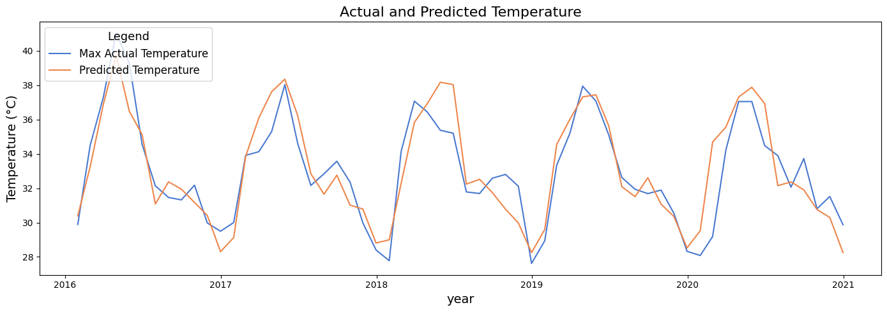
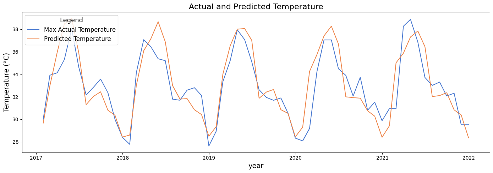
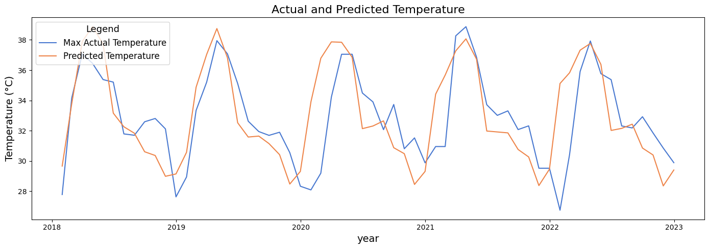

# 🌡️ Temperature Forecasting using Time Series Models

This project aims to forecast monthly maximum temperatures using time series forecasting techniques. Developed as part of a research internship at the India Meteorological Department (IMD), the project applies statistical and machine learning models to analyze and predict temperature patterns over time.


## 🔍 Overview

Accurate temperature forecasting is crucial for agriculture, disaster management, and climate studies. This project focuses on:

- Cleaning and visualizing temperature data
- Applying statistical and deep learning models
- Comparing model performance based on prediction accuracy

---

## ✨ Features

- Exploratory Data Analysis (EDA)
- Stationarity tests and decomposition
- ARIMA, SARIMA modeling
- LSTM-based deep learning model
- Visual comparison of model performance

---

## 📂 Dataset

- **Source:** India Meteorological Department
- **Format:** CSV
- **Fields:** Date, Max Temperature, etc.
- **Location:** Bhubaneswar (can be adapted for other cities)

---

## 🧠 Models Used

| Model Type     | Model Name     | Description                                           |
|----------------|----------------|-------------------------------------------------------|
| Statistical    | ARIMA, SARIMA  | Time series forecasting based on past trends         |
| Deep Learning  | LSTM (Keras)   | Sequence modeling using recurrent neural networks    |

---

## Accuracy 
### Case 1:
for year 2016-2020
r2 0.95 <br>
RMSE 1.18 


### Case 2:
fed 2016 data to model and predict next 5 years:

fed 2017 data to model and predict next 5 years:

## ⚙️ Installation

Clone the repository and install dependencies:

```bash
git clone https://github.com/DeepMathukiya/Temperature.git
cd Temperature
```

